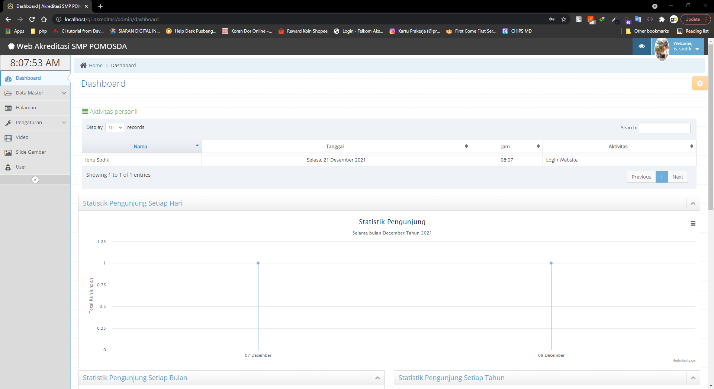
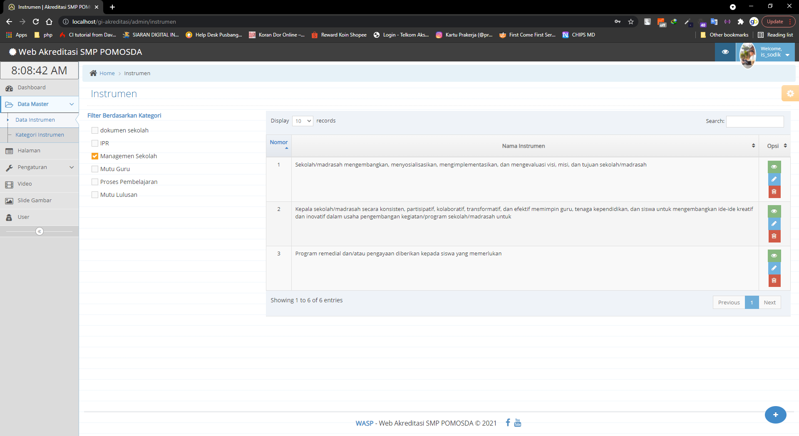
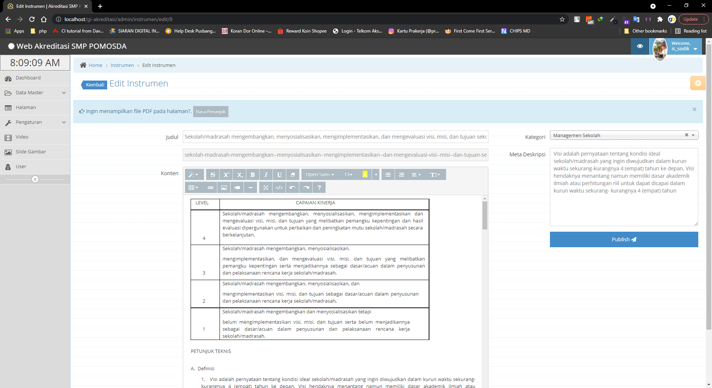
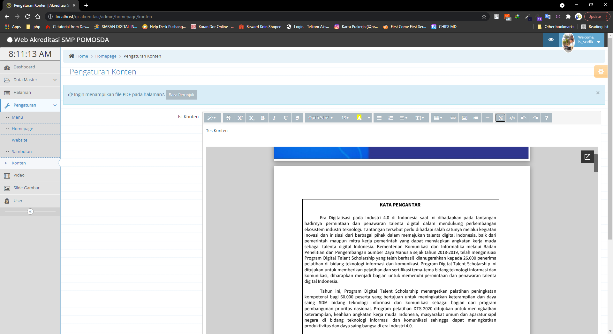
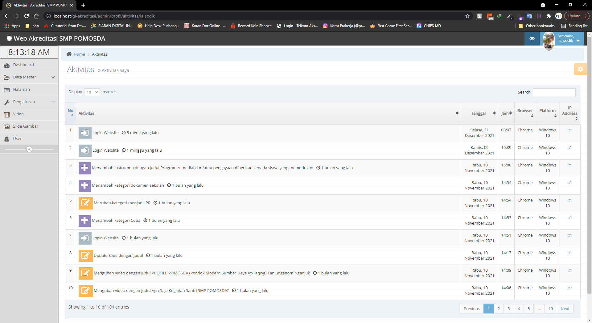
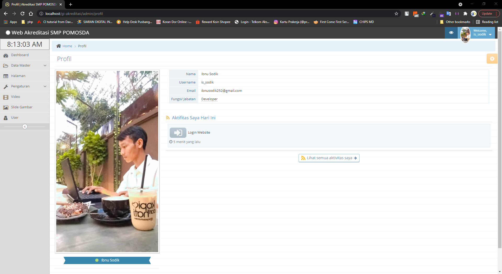
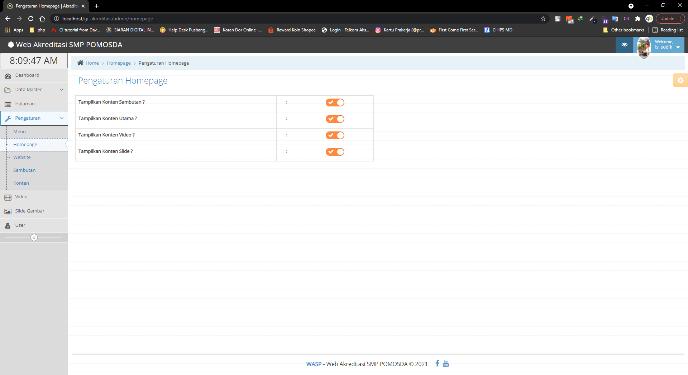
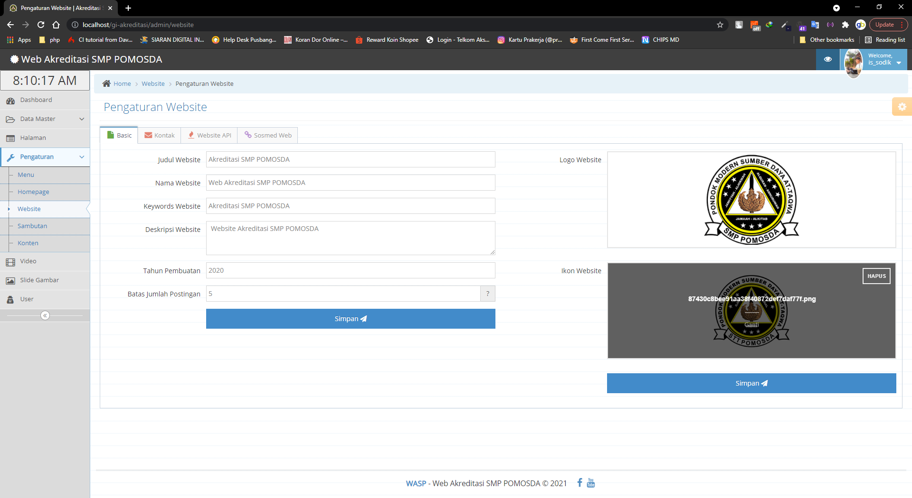
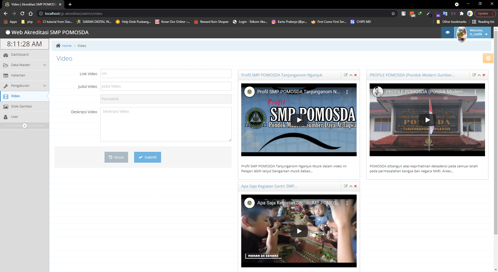

# gi-akreditasi
Merupakan Website Akreditasi Sekolah yang didalamnya memuat file instrumen akreditasi sekolah dan disimpan di dalam g-Drive.
# Tools Project
<ul style="1">
  <li>Codeigniter 3</li>
  <li>Wordpress</li>
  <li>PHP 7.1.4</li>
  <li>jQuery Ajax</li>
  <li>Ace Admin Template</li>
</ul>
# Fitur dan Dokumentasi
<strong>Beckend</strong>

<strong>Frontend</strong>
